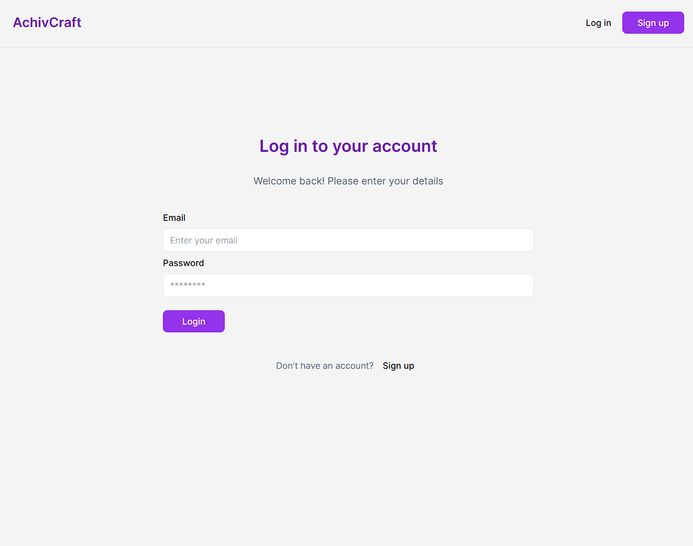
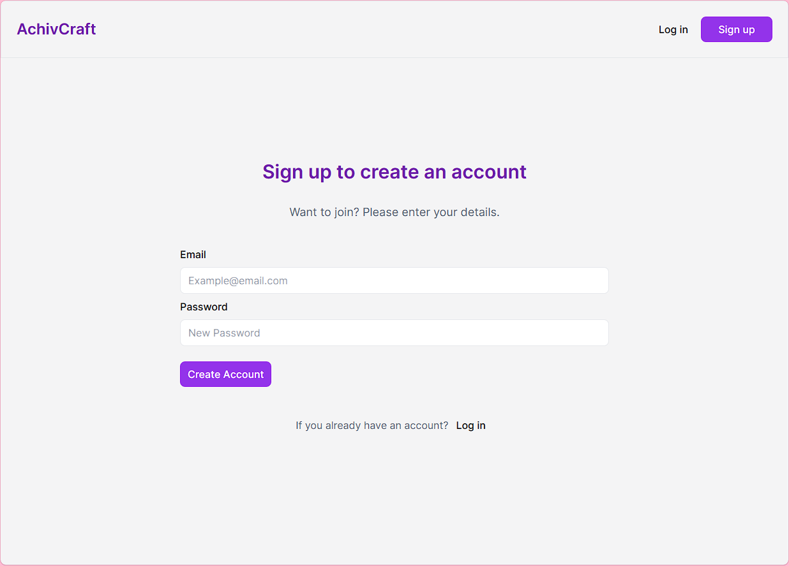
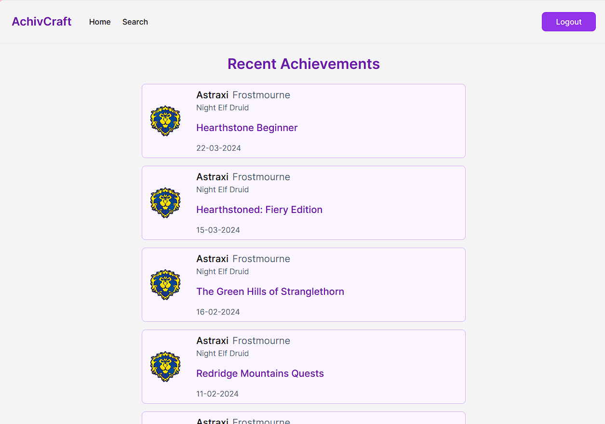
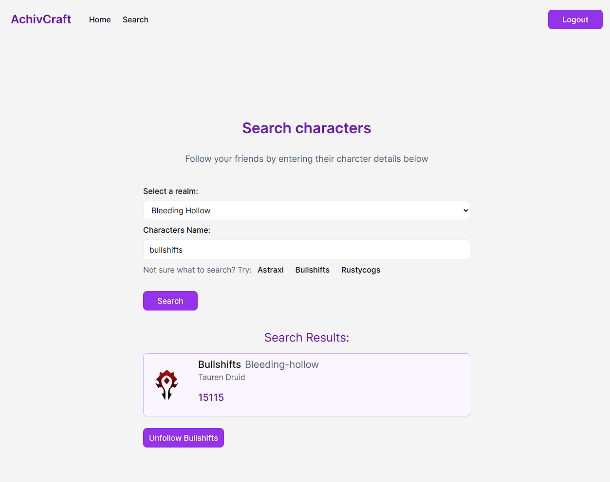

# AchivCraft

## Description:

This independent project is a real-world full-stack application leveraging the Blizzard public API to fetch World of Warcraft character achievements. It’s a CRUD application employing supabase for cloud-based data storage. Users can register, search, follow, and unfollow characters. Upon visiting the homepage, achievements of followed characters are displayed on a timeline and refetched after a stale time of 5 minutes.

## User Story:

1. AS a user I want to log in to the platform.
2. AS a logged in user I want to be able to follow characters
3. AS a logged in user I want to see my followed characters' most recent achievements on the home page.
4. AS a logged in user I want to be able to unfollow characters.
5. As a logged in user I want to be able to logout.

## Tech Stack:

React, Typescript, Node.js, Express.js, Tailwind, Vite, JWT, react-dom, react-router-dom, SQL, Supabase.

## App Screenshots:

### Login Page:

### Sign up Page:

### Home:

### Search:

## Planning Notes & Process

### pages:

Log in page
Sign up page
Home page (timeline showing recent character achievements)
Search page (displays characters to follow based on search, or option to unfollow)

### API Endpoints

### Query wow Characters:

https://develop.battle.net/documentation/world-of-warcraft/profile-apis

Setup my battlenet to use OAuth

### OAuth Access token:

In postman select POST query > Authorization > Basic Auth > _Enter client ID and Secret from Bliz_
In postman select GET query > Authorization > Bearer Token > _Enter the returned Access Token from above request_

### Endpoints I've definined

1. Get Character/{RealmSlug}/{characterName}/achievements
   - This endpoint returns a summary of the achievements a character has completed.
2. Post Follow
   - Adds a character to the users account
   - payload contains: userID, RealmSlug, characterName, region

### Database

SQL
Use [Supabase](https://supabase.com/)

### Github example for oAuth stuff:

https://github.com/Blizzard/node-signature-generator/tree/master

WOW: Client Credentials Flow
https://develop.battle.net/documentation/guides/using-oauth/client-credentials-flow?_gl=1*422mxk*_ga*NzQyNzk1MzY0LjE3MDM3NDQwODg.*_ga_VYKNV7C0S3*MTcwNzIwNjA4Ny4zLjEuMTcwNzIwNzgyMi42MC4wLjA.

Getting Started: https://develop.battle.net/documentation/guides/getting-started

### Started on front end

installed Vite
made some pages with react router
Created call from /login page to "/ping" using a react router Form and action to GET data from the server!

## Design system -> UntitledUI

[Untitled UI](https://www.untitledui.com/)

Created a DB on supabase: https://supabase.com/dashboard/project/orxjphplghtiznnhxddv
Seeded DB online and logged in the user then returned logged in users info to console
Created the ability to enter details on login page, and create new users via the signup page.

- set up DB (think relationships between users and followers)
- Create follow button for Search page for the character listed.

### DB structure:

Created in supabase's online webapp to store db in the cloud
Tables in supabase:
user, character, follow, achievement, achievement_request_timestamp

### Schema Visulizer

### Database Tables

Added:

- funcationality to save character acheivements to the db
- error handling for queries to check if the user is logged in
- Then render characters achievements to the home page / timeline (updates Achievements from Blizzard API every 5 mins if refreshed)
- design ideas (figma)

### Future development

- Responsive styling
- Loading spinner
- Uplift typescript types
- redeploy to vercel as render is slow...

Thank you, Vanessa Bloom <(^.^)>
